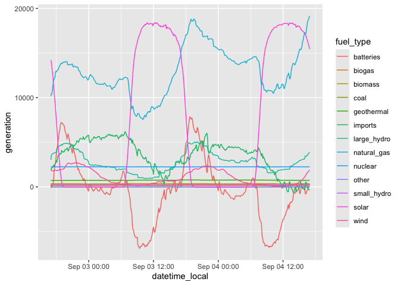

<!-- README.md is generated from README.Rmd. Please edit that file -->

# rgridstatus

<!-- badges: start -->

[](https://github.com/andypicke/rgridstatus/actions/workflows/R-CMD-check.yaml)
[](https://lifecycle.r-lib.org/articles/stages.html#experimental)
[](https://www.repostatus.org/#wip)

<!-- badges: end -->

The goal of rgridstatus is to provide a R API wrapper for the
[GridStatusIO](https://www.gridstatus.io/home)
[API](https://www.gridstatus.io/api).

See also my [blog
post](https://andypicke.quarto.pub/portfolio/posts/rGridStatus/rGridStatus.html)
describing some features of the package.

## Installation

You can install the development version of
[rgridstatus](https://github.com/andypicke/rgridstatus) from
[GitHub](https://github.com/) with:

``` r
# install.packages("devtools")
devtools::install_github("andypicke/rgridstatus")
```

You will need to register for an API key. By default, all functions
assume you have stored your API key in your *.Renviron* file with the
name *GRIDSTATUS_API_KEY*.

## Examples

### Get info on datasets available from GridStatus API:

``` r

library(rgridstatus)
library(tidyverse)
#> ── Attaching core tidyverse packages ──────────────────────── tidyverse 2.0.0 ──
#> ✔ dplyr     1.1.4     ✔ readr     2.1.5
#> ✔ forcats   1.0.0     ✔ stringr   1.5.1
#> ✔ ggplot2   3.5.1     ✔ tibble    3.2.1
#> ✔ lubridate 1.9.3     ✔ tidyr     1.3.1
#> ✔ purrr     1.0.2     
#> ── Conflicts ────────────────────────────────────────── tidyverse_conflicts() ──
#> ✖ dplyr::filter() masks stats::filter()
#> ✖ dplyr::lag()    masks stats::lag()
#> ℹ Use the conflicted package (<http://conflicted.r-lib.org/>) to force all conflicts to become errors

info <- get_available_datasets()
head(info)
#>                                                 id
#> 1                                      all_records
#> 2                           all_records_timeseries
#> 3                                  caiso_as_prices
#> 4                         caiso_as_procurement_dam
#> 5 caiso_curtailed_non_operational_generator_report
#> 6                                caiso_curtailment
#>                                               name
#> 1                                      All Records
#> 2                           All Records Timeseries
#> 3                                  CAISO AS Prices
#> 4                         CAISO AS Procurement DAM
#> 5 CAISO Curtailed Non Operational Generator Report
#> 6                                CAISO Curtailment
#>                                                                                                                                                                                                                                                                                                                                                                                                                                                                                                                                                                                                                                                                                                                                                                                                                                                       description
#> 1                                                                                                                                                                                                                                                                                                                                                                                                                                                                                                                                                                                                                                                                                                                                                                                                           Top daily records for various metrics across all ISOs
#> 2                                                                                                                                                                                                                                                                                                                                                                                                                                                                                                                                                                                                                                                                                                                                                                                                         Timeline of new records for various metrics in all ISOs
#> 3 Ancillary Services Prices as reported by CAISO.\n\n**AS Mapping**\n\nThe *_EXP show only the intertie resources.\n \n-    AS_SP26_P: Resources in AS_SP26\n-    AS_NP26_P: Resources in AS_NP26\n-    AS_SP15_P: Resources in AS_SP15\n-    AS_NP15_P: Resources in AS_NP15\n-    AS_SP26_EXP_P: Resources in AS_SP26_EXP which are not in AS_SP26\n-    AS_NP26_EXP_P: Resources in AS_NP26_EXP which are not in AS_NP26\n-    AS_SP15_EXP_P: Resources in AS_SP15_EXP which are not in AS_SP15\n-    AS_NP15_EXP_P: Resources in AS_NP15_EXP which are not in AS_NP15\n-    AS_CAISO_NP26_P: Resources in AS_CAISO which are not in AS_SP26\n-    AS_CAISO_SP26_P: Resources in AS_CAISO which are not in AS_NP26\n-    AS_CAISO_NP15_P: Resources in AS_CAISO which are not in AS_SP15\n-    AS_CAISO_SP15_P: Resources in AS_CAISO which are not in AS_NP15
#> 4                                                                                                                                                                                                                                                                                                                                                                                                                                                                                                                                                                                                                                          Ancillary services procurement data from CAISO.\nIncludes total MW procured and costs.  Corresponds\nto CAISO AS_RESULTS dataset on OASIS. See caiso_as_prices dataset\nfor per MW prices that result from market run.
#> 5                                                                                                                                                                                                                                                                                                                                                                                                                                                                                                                                                                                                                                                                                                                                          Prior Day Curtailed Non-Operational Generator Report as reported by CAISO.\n\nGlossary: https://www.caiso.com/glossary
#> 6                                                                                                                                                                                                                                                                                                                                                                                                                                                                                                                                                                                                                                                                                                                                  Daily Curtailment data as reported by CAISO.\n\nNote: CAISO did not publish curtailment reports for 2024-07-26 and 2024-07-27.
#>     earliest_available_time     latest_available_time     source
#> 1 2017-12-13T22:05:00+00:00 2024-09-17T00:15:00+00:00 gridstatus
#> 2 2011-01-01T06:30:00+00:00 2024-09-11T23:10:00+00:00 gridstatus
#> 3 2010-01-01T08:00:00+00:00 2024-09-25T06:00:00+00:00      caiso
#> 4 2010-01-01T08:00:00+00:00 2024-09-25T06:00:00+00:00      caiso
#> 5 2021-06-18T07:00:00+00:00 2024-09-24T07:00:00+00:00      caiso
#> 6 2017-01-01T12:00:00+00:00 2024-09-23T00:00:00+00:00      caiso
#>           last_checked_time
#> 1 2024-09-24T16:51:59+00:00
#> 2 2024-09-24T16:51:59+00:00
#> 3 2024-09-24T16:54:44+00:00
#> 4 2024-09-24T16:54:50+00:00
#> 5 2024-09-24T15:36:34+00:00
#> 6 2024-09-24T16:54:53+00:00
#>                                                   primary_key_columns
#> 1                                 iso, rank, record_type, metric_name
#> 2                   iso, interval_start_utc, record_type, metric_name
#> 3                                  interval_start_utc, region, market
#> 4                                          interval_start_utc, region
#> 5               publish_time_utc, outage_mrid, curtailment_start_time
#> 6 interval_start_utc, curtailment_type, curtailment_reason, fuel_type
#>   publish_time_column      time_index_column subseries_index_column
#> 1                <NA>     interval_start_utc                   <NA>
#> 2                <NA>     interval_start_utc                   <NA>
#> 3                <NA>     interval_start_utc                 region
#> 4                <NA>     interval_start_utc                 region
#> 5    publish_time_utc curtailment_start_time                   <NA>
#> 6                <NA>     interval_start_utc                   <NA>
#>                                                                                                                                                                                                                                                                                                                                                                                                                                                                                                                                                                                                                                                                                                                                                                                                                                                                                                                                                                                                                                                                                                                                                                                                                                                                                                                                                                                                                                                                                                                                                                                                                                                                                                                                all_columns
#> 1                                                                                                                                                                                                                                                                                                                                                                                                                                                                                                                                                                                                                                                                                                                                                                                                                                                                                                                                                                                                                                                                                                                                                                                                                                                                                                                                                                                                                                                                                                   rank, iso, interval_start_utc, date, record_type, metric_name, metric_value, BIGINT, TEXT, TIMESTAMP, DATE, TEXT, TEXT, DOUBLE PRECISION, TRUE, FALSE, FALSE, FALSE, FALSE, FALSE, TRUE, FALSE, FALSE, TRUE, TRUE, FALSE, FALSE, FALSE
#> 2                                                                                                                                                                                                                                                                                                                                                                                                                                                                                                                                                                                                                                                                                                                                                                                                                                                                                                                                                                                                                                                                                                                                                                                                                                                                                                                                                                                                                                                                                                                              iso, interval_start_utc, date, record_type, metric_name, metric_value, TEXT, TIMESTAMP, DATE, TEXT, TEXT, DOUBLE PRECISION, FALSE, FALSE, FALSE, FALSE, FALSE, TRUE, FALSE, TRUE, TRUE, FALSE, FALSE, FALSE
#> 3                                                                                                                                                                                                                                                                                                                                                                                                                                                                                                                                                                                                                                                                                                                                                                                                                                                                                                                                                                                                                                                                                                                                                                                                                                                                   interval_start_utc, interval_end_utc, region, market, non_spinning_reserves, regulation_down, regulation_mileage_down, regulation_mileage_up, regulation_up, spinning_reserves, TIMESTAMP, TIMESTAMP, VARCHAR, VARCHAR, DOUBLE PRECISION, DOUBLE PRECISION, DOUBLE PRECISION, DOUBLE PRECISION, DOUBLE PRECISION, DOUBLE PRECISION, FALSE, FALSE, FALSE, FALSE, TRUE, TRUE, TRUE, TRUE, TRUE, TRUE, TRUE, TRUE, FALSE, FALSE, FALSE, FALSE, FALSE, FALSE, FALSE, FALSE
#> 4 interval_start_utc, interval_end_utc, region, market, non_spinning_reserves_procured_mw, non_spinning_reserves_self_provided_mw, non_spinning_reserves_total_mw, non_spinning_reserves_total_cost, regulation_down_procured_mw, regulation_down_self_provided_mw, regulation_down_total_mw, regulation_down_total_cost, regulation_mileage_down_procured_mw, regulation_mileage_down_self_provided_mw, regulation_mileage_down_total_mw, regulation_mileage_down_total_cost, regulation_mileage_up_procured_mw, regulation_mileage_up_self_provided_mw, regulation_mileage_up_total_mw, regulation_mileage_up_total_cost, regulation_up_procured_mw, regulation_up_self_provided_mw, regulation_up_total_mw, regulation_up_total_cost, spinning_reserves_procured_mw, spinning_reserves_self_provided_mw, spinning_reserves_total_mw, spinning_reserves_total_cost, TIMESTAMP, TIMESTAMP, VARCHAR, VARCHAR, DOUBLE PRECISION, DOUBLE PRECISION, DOUBLE PRECISION, DOUBLE PRECISION, DOUBLE PRECISION, DOUBLE PRECISION, DOUBLE PRECISION, DOUBLE PRECISION, DOUBLE PRECISION, DOUBLE PRECISION, DOUBLE PRECISION, DOUBLE PRECISION, DOUBLE PRECISION, DOUBLE PRECISION, DOUBLE PRECISION, DOUBLE PRECISION, DOUBLE PRECISION, DOUBLE PRECISION, DOUBLE PRECISION, DOUBLE PRECISION, DOUBLE PRECISION, DOUBLE PRECISION, DOUBLE PRECISION, DOUBLE PRECISION, FALSE, FALSE, FALSE, FALSE, TRUE, TRUE, TRUE, TRUE, TRUE, TRUE, TRUE, TRUE, TRUE, TRUE, TRUE, TRUE, TRUE, TRUE, TRUE, TRUE, TRUE, TRUE, TRUE, TRUE, TRUE, TRUE, TRUE, TRUE, TRUE, TRUE, FALSE, FALSE, FALSE, FALSE, FALSE, FALSE, FALSE, FALSE, FALSE, FALSE, FALSE, FALSE, FALSE, FALSE, FALSE, FALSE, FALSE, FALSE, FALSE, FALSE, FALSE, FALSE, FALSE, FALSE, FALSE, FALSE
#> 5                                                                                                                                                                                                                                                                                                                                                                                                                                                                                                                                                                                                                                                                                                                                                                                                                                                                                                                                                                                                                                                                                                                                                                                                                                                publish_time_utc, outage_mrid, resource_name, resource_id, outage_type, nature_of_work, curtailment_start_time, curtailment_end_time, curtailment_mw, resource_pmax_mw, net_qualifying_capacity_mw, TIMESTAMP, INTEGER, VARCHAR, VARCHAR, VARCHAR, VARCHAR, TIMESTAMP, TIMESTAMP, DOUBLE PRECISION, DOUBLE PRECISION, DOUBLE PRECISION, FALSE, TRUE, FALSE, FALSE, FALSE, FALSE, FALSE, FALSE, TRUE, TRUE, TRUE, TRUE, FALSE, FALSE, FALSE, FALSE, FALSE, TRUE, TRUE, FALSE, FALSE, FALSE
#> 6                                                                                                                                                                                                                                                                                                                                                                                                                                                                                                                                                                                                                                                                                                                                                                                                                                                                                                                                                                                                                                                                                                                                                                                                                                                                                                                                                                                                                                                  interval_start_utc, interval_end_utc, curtailment_type, curtailment_reason, fuel_type, curtailment_mwh, curtailment_mw, TIMESTAMP, TIMESTAMP, VARCHAR, VARCHAR, VARCHAR, INTEGER, INTEGER, FALSE, FALSE, FALSE, FALSE, FALSE, TRUE, TRUE, TRUE, TRUE, FALSE, FALSE, FALSE, FALSE, FALSE
#>   number_of_rows_approximate        table_type is_in_snowflake data_frequency
#> 1                        560 materialized_view           FALSE      IRREGULAR
#> 2                       1871 materialized_view           FALSE      IRREGULAR
#> 3                     621445             table            TRUE         1_HOUR
#> 4                     623449             table            TRUE         1_HOUR
#> 5                    2200875             table            TRUE      IRREGULAR
#> 6                      67748             table            TRUE      5_MINUTES
#>   is_published                created_at                updated_at
#> 1         TRUE                      <NA>                      <NA>
#> 2         TRUE                      <NA>                      <NA>
#> 3         TRUE 2023-04-20T07:00:37+00:00 2024-08-21T18:50:24+00:00
#> 4         TRUE 2023-11-20T15:34:56+00:00 2024-08-21T18:50:57+00:00
#> 5         TRUE 2023-10-04T00:04:17+00:00 2024-09-17T01:15:18+00:00
#> 6         TRUE 2023-04-20T16:35:38+00:00 2024-09-17T01:15:27+00:00
#>                                                                                 source_url
#> 1                                                                                     <NA>
#> 2                                                                                     <NA>
#> 3                                                 http://oasis.caiso.com/mrioasis/logon.do
#> 4                                                 http://oasis.caiso.com/mrioasis/logon.do
#> 5 https://www.caiso.com/market-operations/outages/curtailed-and-non-operational-generators
#> 6                      https://www.caiso.com/about/our-business/managing-the-evolving-grid
#>   publication_frequency
#> 1                  <NA>
#> 2                  <NA>
#> 3                  <NA>
#> 4                  <NA>
#> 5                  <NA>
#> 6                  <NA>
```

### Get unique data source names

Most of the “sources” are
[ISOs](https://en.wikipedia.org/wiki/Regional_transmission_organization_(North_America)).

``` r

# input is info from get_available_datasets()
sources <- get_source_names(info)
sources
#>  [1] "all"     "caiso"   "dataset" "eia"     "ercot"   "ieso"    "isone"  
#>  [8] "isos"    "miso"    "nyiso"   "pjm"     "spp"
```

### Get dataset names for one operator/source

The dataset names all start with the ISO/source, so it is easy to filter
by those:

``` r

info_caiso <- get_available_datasets() |> 
  dplyr::filter(stringr::str_detect(name,"^CAISO_")) # name starts with "CAISO_"
```

### Get a list of dataset updates

``` r

updates <- get_dataset_updates()
head(updates)
#>   id                  dataset                  time_utc num_rows_updated
#> 1  1  pjm_lmp_real_time_5_min 2023-04-19T22:10:19+00:00               34
#> 2  2 miso_lmp_real_time_5_min 2023-04-19T22:10:41+00:00              345
#> 3  3                miso_load 2023-04-19T22:11:46+00:00                1
#> 4  4            miso_fuel_mix 2023-04-19T22:11:54+00:00                1
#> 5  5           caiso_fuel_mix 2023-04-19T22:11:55+00:00                4
#> 6  6               caiso_load 2023-04-19T22:11:56+00:00                1
```

Again, you can filter the results to get updates for a specific
ISO/source:

``` r

updates_caiso <- updates |> dplyr::filter(stringr::str_detect(dataset, "^caiso_"))
updates_caiso
#>    id                    dataset                  time_utc num_rows_updated
#> 1   5             caiso_fuel_mix 2023-04-19T22:11:55+00:00                4
#> 2   6                 caiso_load 2023-04-19T22:11:56+00:00                1
#> 3   7  caiso_lmp_real_time_5_min 2023-04-19T22:12:21+00:00               12
#> 4   8              caiso_storage 2023-04-19T22:12:28+00:00                1
#> 5  30             caiso_fuel_mix 2023-04-19T22:17:27+00:00                3
#> 6  31                 caiso_load 2023-04-19T22:17:27+00:00                1
#> 7  32  caiso_lmp_real_time_5_min 2023-04-19T22:17:51+00:00               12
#> 8  33              caiso_storage 2023-04-19T22:17:57+00:00                1
#> 9  41 caiso_lmp_real_time_15_min 2023-04-19T22:20:18+00:00               12
#> 10 57             caiso_fuel_mix 2023-04-19T22:22:36+00:00                7
#> 11 58                 caiso_load 2023-04-19T22:22:37+00:00                1
#> 12 59  caiso_lmp_real_time_5_min 2023-04-19T22:23:01+00:00               12
#> 13 60              caiso_storage 2023-04-19T22:23:07+00:00                1
#> 14 76             caiso_fuel_mix 2023-04-19T22:27:34+00:00                6
#> 15 77                 caiso_load 2023-04-19T22:27:34+00:00                1
#> 16 81  caiso_lmp_real_time_5_min 2023-04-19T22:27:58+00:00               12
#> 17 82              caiso_storage 2023-04-19T22:28:04+00:00                1
```

### Download a dataset

``` r

df <- get_gridstatus_dataset(wh_dataset = "caiso_fuel_mix", 
                             start_time = "2024-09-03", 
                             end_time = "2024-09-05")

str(df)
#> 'data.frame':    575 obs. of  15 variables:
#>  $ interval_start_utc: POSIXct, format: "2024-09-03 00:00:00" "2024-09-03 00:05:00" ...
#>  $ solar             : int  14210 13948 13542 13020 12638 12029 11346 10671 10154 9555 ...
#>  $ wind              : int  1837 1828 1789 1799 1795 1792 1825 1821 1872 1874 ...
#>  $ geothermal        : int  727 727 729 728 729 729 729 727 728 729 ...
#>  $ biomass           : int  346 347 347 347 348 348 349 347 347 348 ...
#>  $ biogas            : int  157 157 157 156 155 155 156 156 157 156 ...
#>  $ small_hydro       : int  261 259 259 261 259 259 260 260 258 258 ...
#>  $ coal              : int  0 0 0 0 0 0 0 0 0 0 ...
#>  $ nuclear           : int  2241 2242 2243 2243 2241 2243 2242 2243 2243 2244 ...
#>  $ natural_gas       : int  10173 10440 10408 10707 11173 11582 11906 12065 12162 12262 ...
#>  $ large_hydro       : int  3030 3464 3644 3681 3701 3740 3774 3780 3811 3822 ...
#>  $ batteries         : int  239 -92 -8 228 295 444 861 1626 2016 2437 ...
#>  $ imports           : int  2040 1913 2130 2199 2180 2315 2448 2312 2342 2550 ...
#>  $ other             : int  0 0 0 0 0 0 0 0 0 0 ...
#>  $ datetime_local    : POSIXct, format: "2024-09-02 17:00:00" "2024-09-02 17:05:00" ...
```

### Pivot fuel mix dataframe to long format for easier plotting

{rgridstatus} contains a convenience function *pivot_gen_long()* to
pivot the fuel mix dataframe to a long format. This can make it easier
to plot multiple timeseries.

``` r

df_long <- pivot_gen_long(df)

head(df_long)
#> # A tibble: 6 × 4
#>   interval_start_utc  datetime_local      fuel_type   generation
#>   <dttm>              <dttm>              <chr>            <int>
#> 1 2024-09-03 00:00:00 2024-09-02 17:00:00 solar            14210
#> 2 2024-09-03 00:00:00 2024-09-02 17:00:00 wind              1837
#> 3 2024-09-03 00:00:00 2024-09-02 17:00:00 geothermal         727
#> 4 2024-09-03 00:00:00 2024-09-02 17:00:00 biomass            346
#> 5 2024-09-03 00:00:00 2024-09-02 17:00:00 biogas             157
#> 6 2024-09-03 00:00:00 2024-09-02 17:00:00 small_hydro        261
```

With the data in a long format, we can just specify that the color or
linetype should correspond to the *fuel_type*.

``` r


df_long |>
  ggplot(aes(datetime_local, generation)) +
  geom_line(aes(color = fuel_type)) 
```


